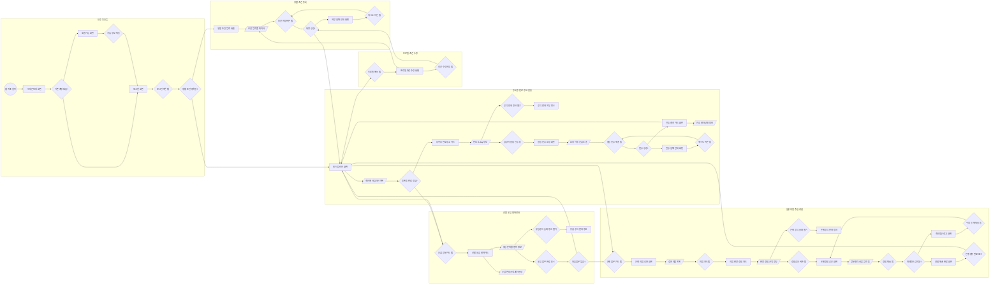

```mermaid
flowchart LR

  subgraph s1 ["인증 및 진입"]
    n1(("앱 최초 실행"))
    n2["시작/온보딩 화면"]
    n3{"기존 계정 있음?"}
    n4["회원가입 화면"]
    n5{"가입 정보 제출"}
    n6["로그인 화면"]
    n7{"로그인 버튼 탭"}
    n8{"생활 조건 등록됨?"}
  end

  subgraph s2 ["생활 조건 등록"]
    n9["생활 조건 입력 화면"]
    n10[/"조건 입력 폼 데이터"/]
    n11{"조건 저장 버튼 탭"}
    n12{"저장 성공?"}
    n13["저장 실패 안내 화면"]
    n14{"재시도 버튼 탭"}
  end

  subgraph s3 ["등록증 만료 경고·알림"]
    n15["홈 타임라인 화면"]
    n16[/"개인별 타임라인 목록"/]
    n17{"등록증 만료 경고?"}
    n18["등록증 만료 경고 카드"]
    n19[/"만료 D-day 정보"/]
    n20{"공식 안내 링크 열기"}
    n21["공식 안내 외부 링크"]
    n22{"담당자 알림 전송 탭"}
    n23["알림 전송 요청 화면"]
    n24[/"요청 사유·긴급도 폼"/]
    n25{"알림 전송 제출 탭"}
    n26{"전송 성공?"}
    n27["전송 결과 카드 화면"]
    n28[/"전송 결과 상태 정보"/]
    n29["전송 실패 안내 화면"]
    n30{"재시도 버튼 탭"}
  end

  subgraph s4 ["선불 유심 절차 안내"]
    n31{"유심 업무 카드 탭"}
    n32["선불 유심 절차 카드"]
    n33[/"유심 준비물·절차 정보"/]
    n34[/"유심 현장규칙·예시문장"/]
    n35{"유심 공식 출처 링크 열기"}
    n36["유심 공식 안내 링크"]
    n37{"유심 업무 완료 표시"}
    n38{"다음 업무 있음?"}
  end

  subgraph s5 ["은행 지점 추천·경험"]
    n39{"은행 업무 카드 탭"}
    n40["은행 지점 추천 화면"]
    n41[/"추천 지점 목록"/]
    n42{"지점 카드 탭"}
    n43["지점 현장 경험 카드"]
    n44[/"현장 경험·규칙 정보"/]
    n45{"은행 공식 출처 열기"}
    n46["은행 공식 안내 링크"]
    n47{"경험 공유 버튼 탭"}
    n48["은행 경험 공유 화면"]
    n49[/"방문결과·서류 입력 폼"/]
    n50{"개인정보 감지됨?"}
    n51["개인정보 경고 화면"]
    n52{"수정 후 재제출 탭"}
    n53{"경험 제출 탭"}
    n54["경험 제출 완료 화면"]
    n55{"은행 업무 완료 표시"}
  end

  subgraph s6 ["프로필·조건 수정"]
    n56["프로필·조건 수정 화면"]
    n57{"프로필 메뉴 탭"}
    n58{"조건 수정 저장 탭"}
  end

  n1 --> n2
  n2 --> n3
  n3 --> n6
  n3 --> n4
  n4 --> n5
  n5 --> n6
  n6 --> n7
  n7 --> n8
  n8 --> n9
  n8 --> n15
  n9 --> n10
  n10 --> n11
  n11 --> n12
  n12 --> n15
  n12 --> n13
  n13 --> n14
  n14 --> n11
  n15 --> n16
  n16 --> n17
  n17 --> n18
  n17 --> n31
  n18 --> n19
  n19 --> n20
  n20 --> n21
  n19 --> n22
  n22 --> n23
  n23 --> n24
  n24 --> n25
  n25 --> n26
  n26 --> n27
  n26 --> n29
  n27 --> n28
  n29 --> n30
  n30 --> n25
  n27 --> n15
  n15 --> n31
  n31 --> n32
  n32 --> n33
  n32 --> n34
  n33 --> n35
  n35 --> n36
  n33 --> n37
  n37 --> n38
  n38 --> n39
  n38 --> n15
  n15 --> n39
  n39 --> n40
  n40 --> n41
  n41 --> n42
  n42 --> n43
  n43 --> n44
  n44 --> n45
  n45 --> n46
  n44 --> n47
  n47 --> n48
  n48 --> n49
  n49 --> n53
  n53 --> n50
  n50 --> n51
  n50 --> n54
  n51 --> n52
  n52 --> n48
  n54 --> n55
  n55 --> n15
  n15 --> n57
  n57 --> n56
  n56 --> n10
  n56 --> n58
  n58 --> n12
```
